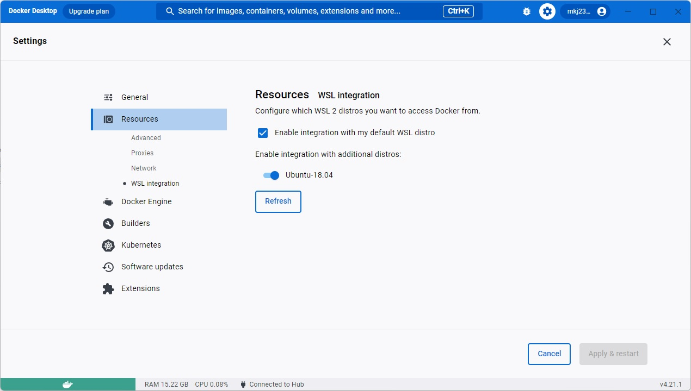

# Pipeline Exercise

## Project Approach:
The objective of this project is to offer a pre-configured Jenkins Docker container with a ready-to-use pipeline for building the Git repository, creating a Docker image, and deploying it within the same Docker environment where Jenkins is running.

## Test Environment (two options):
The test environment used for this project included the following components:

1. Windows + docker desktop + WSL (Ubuntu 18.04)
   *The WSL Ubuntu 18.04 needs to have the distro integration enable at the docker desktop as you can see in the image bellow:



2. Mac + docker desktop

## Project Files:
All the necessary files for this project are available in this Git repository.

* Dockerfile-petclinic 		– pet clinic image file
* Jenkinsfile 			– pipeline steps
* Dockerfile-jenkins 		– Jenkins image file
* Docker-compose-mysql.yml 	– Docker compose for mysql
* Docker-compose-file.yml 	– Docker compose based on job that uses Jekinsfile for petclinic application
* Settings.xml 			– Maven settings that uses Jcenter
* Start_jenkins.sh 		– script to deploy jenkins used on Mac
* Config-repo.xml 		– Jenkins configuration to be used by jenkinsfile job
* Config-script.xml 		– Jenkins configuration to be used by jenkins script job

## The project includes the following steps:

1. Building a Jenkins image using Docker Desktop.
2. Deploying the Jenkins container using Docker Desktop.
3. Executing the pipeline available in the Jenkinsfile.
4. Building the MySQL image and deploying it on Docker Desktop.
5. Deploying the My Pet Clinic application on Docker Desktop.
6. Testing the My Pet Clinic application.

### Note: Before executing Windows commands, ensure you have initiated a WSL (Windows Subsystem for Linux) session from an administrator CMD prompt with root access. To do this, use the following command:

```bash
wsl -u root -d Ubuntu-18.04
```
* Replace Ubuntu-18.04 with the name of your specific WSL distribution, which can be found using the wsl --list command.

# Project Steps:

## 1. Building a Jenkins image using Docker Desktop:

```bash
docker build -f Dockerfile-jenkins -t jenkins_alfa .  
```

## 2. Deploying the Jenkins container using Docker Desktop:

Windows:

```bash
docker network create pipeline_network
```
```bash
docker run -d --network pipeline_network -v /var/run/docker.sock:/var/run/docker.sock -v jenkins_home:/var/jenkins_home -e JAVA_OPTS="-Djenkins.install.runSetupWizard=false" -e JENKINS_ADMIN_ID=admin -e JENKINS_ADMIN_PASSWORD=admin -p 8080:8080 -p 50000:50000 --privileged --name jenkins jenkins_alfa
```

MacOS:

```bash
./start_jenkins.sh 
```

## 3. Executing the pipeline available in the Jenkinsfile.

Access Jenkins: localhost:8080

*We will be focusing on the petclinic-by-jenkinsfile job as it employs the Jenkinsfile approach to manage the pipeline for the Petclinic project.

## 4. Building the MySQL image and deploying it on Docker Desktop.

```bash
docker-compose -f docker-compose-mysql.yml up -d
```

### Attention Note: The Docker Compose files were split because of an issue encountered in the Windows environment, where the application would fail to start if deployed before 40 seconds. Please ensure you wait for the initial processing spike from the MySQL container. In my case, it took 40 seconds for the spike to subside and the application to start successfully.

## 5. Deploying the My Pet Clinic application on Docker Desktop.

Windows:

```bash
docker-compose -f docker-compose-file.yml up -d
```

MacOS:

```bash
docker-compose -f docker-compose-file-macos.yml up -d
```

## 6. Testing the My Pet Clinic application.

Access my pet clinic application: localhost:9090

* The final step in this process is to record a new owner in the MySQL database and then verify the changes by inspecting the owners table using DBeaver, a database management tool. 


